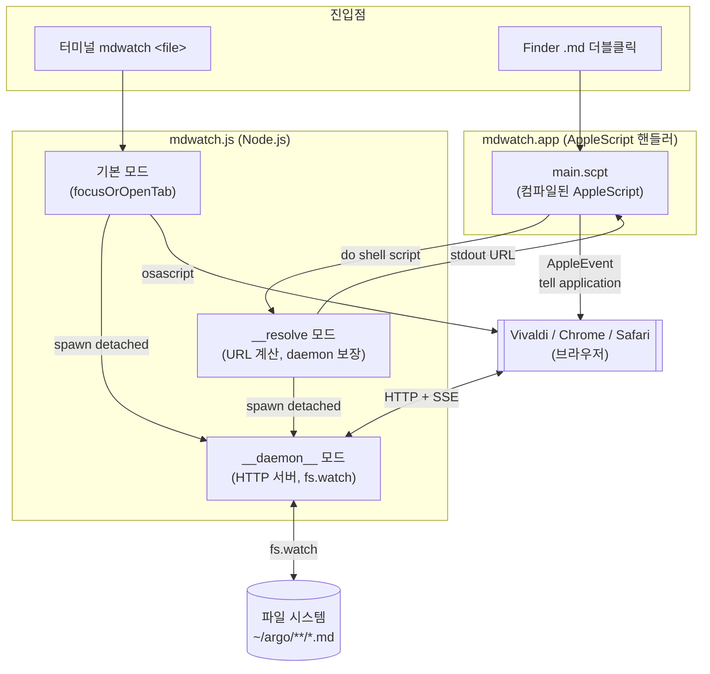
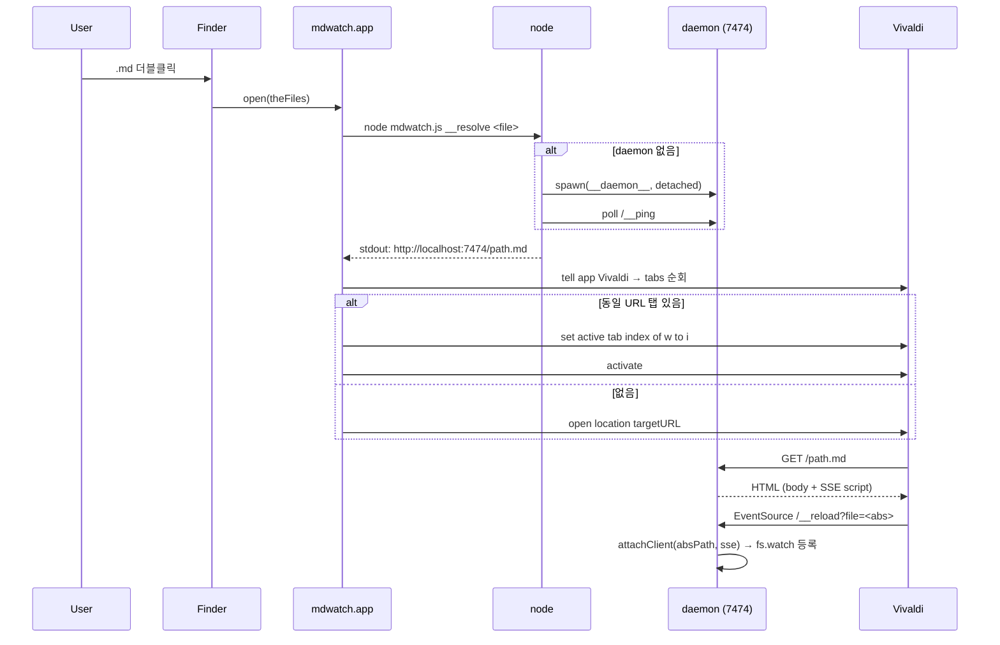
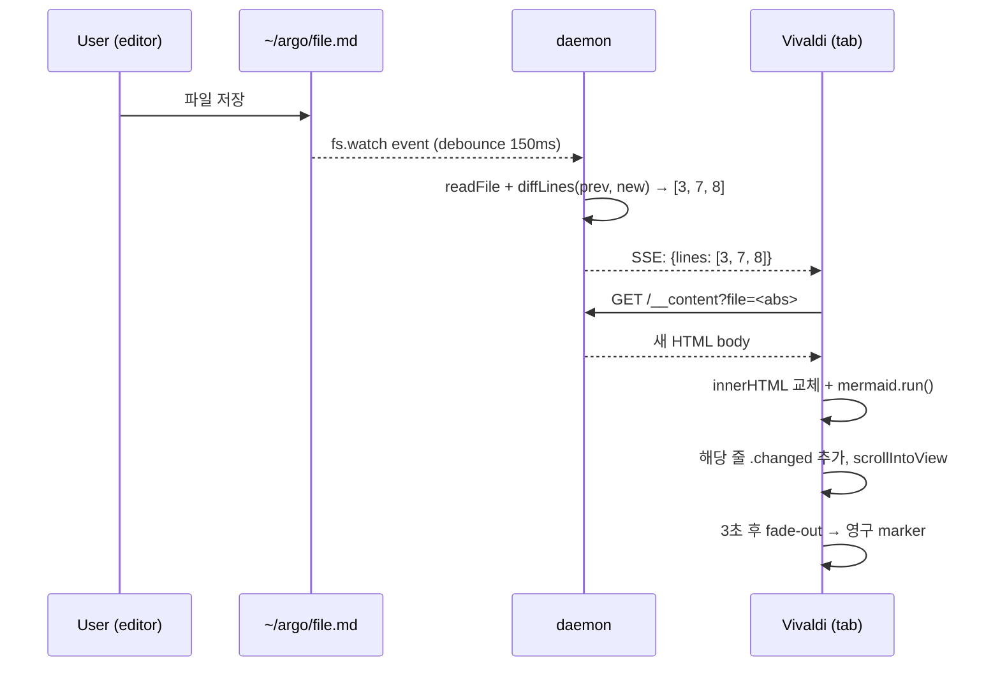

# 아키텍처

## 전체 구조



## 컴포넌트

### 1. mdwatch.js (Node.js — 단일 파일)

| 모드 | 인자 | 동작 |
|------|------|------|
| 기본 (CLI) | `<file>` | daemon 보장 → `focusOrOpenTab(url)` (osascript 직접 호출) |
| `__resolve` | `__resolve <file>` | daemon 보장 → URL을 stdout 출력 → 즉시 종료 |
| `__daemon__` | `__daemon__` | HTTP 서버 시작, 영원히 실행 (자기 자신이 detached 자식으로 spawn) |

핵심 함수:
- `urlToFile(reqUrl)` / `fileToUrl(absPath)` — URL ↔ 절대경로 양방향 매핑, traversal 방어
- `renderContent(md)` — marked로 HTML 변환 + 각 블록에 `data-line` 주입 + mermaid 블록 보존
- `attachClient(absPath, res)` / `detachClient(absPath, res)` — 파일별 SSE 클라이언트 + watcher 관리 (refcount)
- `diffLines(old, new)` — 앞/뒤 동일 부분 제외한 변경 줄 구간 계산

### 2. main.applescript (mdwatch.app 안의 컴파일된 AppleScript)

```
on open theFiles:
  1. POSIX 경로 추출
  2. do shell script "node mdwatch.js __resolve <file>" → URL 획득
  3. tell application "Vivaldi" → 동일 URL 탭 검색
  4. 있으면 active tab index 변경 + activate
  5. 없으면 open location targetURL
```

**왜 AppleScript에서 직접 Vivaldi를 제어하는가**: TCC(macOS Automation 권한)는 AppleEvent를 **발송한 프로세스의 책임자(responsible process)** 기준으로 부여됩니다. node가 spawn 한 osascript는 책임자 추적이 복잡해 권한이 누락되기 쉽습니다. mdwatch.app 안의 AppleScript가 직접 `tell application` 하면 mdwatch.app 단위로 권한이 한 번 부여되고 영구 적용됩니다.

### 3. mdwatch.app (인스톨 시 osacompile로 생성)

```
/Applications/mdwatch.app/
├── Contents/
│   ├── Info.plist                        # CFBundleIdentifier=local.mdwatch
│   │                                     # NSAppleEventsUsageDescription 포함
│   │                                     # CFBundleDocumentTypes: md, markdown
│   ├── MacOS/applet                      # AppleScript Applet 런타임
│   └── Resources/Scripts/main.scpt       # 컴파일된 AppleScript
```

## 데이터 흐름

### Finder 더블클릭 시퀀스



### 파일 저장 시 자동 리프레시



## TCC (macOS Automation) 권한 모델

mdwatch 체인:
```
Finder → mdwatch.app → [node → daemon spawn (별개 체인)]
                    └→ Vivaldi (AppleEvent)
```

| 보낸 주체 | 받는 앱 | 필요한 TCC entry |
|-----------|---------|-----------------|
| mdwatch.app | Vivaldi (또는 다른 기본 브라우저) | `local.mdwatch | com.vivaldi.Vivaldi | allowed` |
| Terminal/Warp (CLI 사용 시) | Vivaldi | `dev.warp.Warp-Stable | com.vivaldi.Vivaldi | allowed` |

첫 실행 시 macOS가 권한 다이얼로그를 띄웁니다. 거부하거나 무시하면 `-1743 Apple Event 권한 없음` 에러로 silent fail → fallback `open`이 동작 (새 탭). 권한을 다시 받으려면:

```bash
# bundle ID 명시 reset (필요 시)
tccutil reset AppleEvents local.mdwatch
# 또는 System Settings > Privacy & Security > Automation에서 토글
```

## URL 매핑

| 패턴 | 예시 |
|------|------|
| ROOT(`~/argo`) 내부 | `http://localhost:7474/automation/foo.md` |
| ROOT 외부 (절대경로 fallback) | `http://localhost:7474/?abs=%2FUsers%2Falvin%2FDownloads%2Ffoo.md` |
| 경로 traversal | `path.resolve(ROOT, '.' + decoded)` 후 `startsWith(ROOT)` 검증 → 실패 시 403 |

## 메모리 모델

- 단일 daemon 프로세스가 모든 파일을 관리합니다.
- `watchers: Map<absPath, {watcher, prevContent, clients: Set<res>}>` — 파일당 1 watcher, 같은 파일 다중 탭은 watcher 공유.
- 클라이언트 disconnect 시 refcount=0 이면 watcher 닫고 Map에서 제거.
- 측정값: idle 25 MB, 파일 5개 동시 watch 30 MB (Physical footprint).

## 설계 결정 (Why)

| 결정 | 이유 |
|------|------|
| marked 인라인 번들 | `npm install` 불필요, 단일 파일 배포 가능 |
| HTML sanitization 없음 | 사용자가 작성한 마크다운에 인라인 `style` 속성 등 자유롭게 쓸 수 있게 |
| 포트 고정 (7474) | 브라우저 북마크 안정성 |
| daemon 자동 fork | 사용자가 별도로 데몬 관리할 필요 없음 |
| AppleScript focus는 mdwatch.app 내부 | TCC 권한 chain을 mdwatch.app 단위로 단순화 |
| 부분 업데이트 (SSE) | 전체 새로고침이면 스크롤 위치/테마/마커 상태 모두 리셋 |
